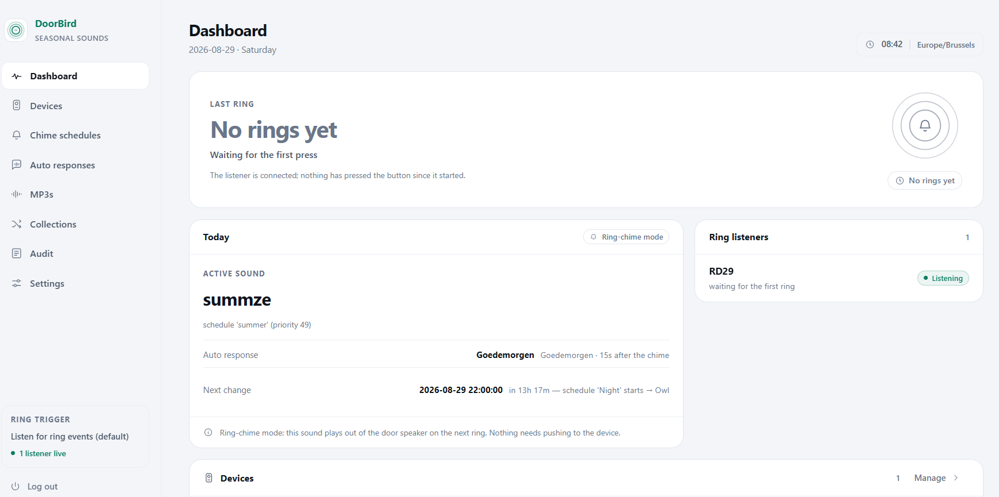
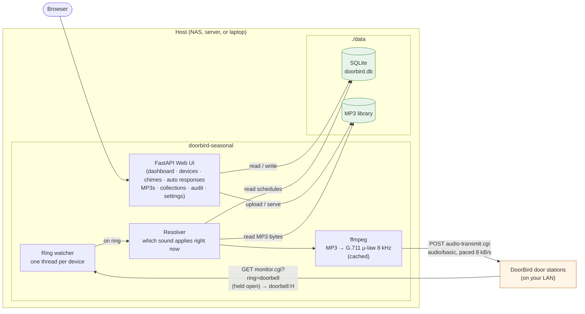
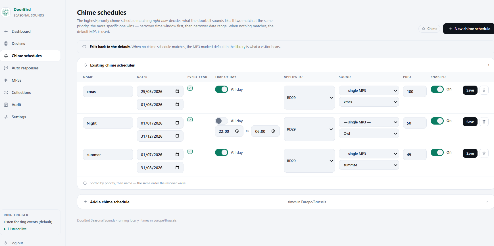
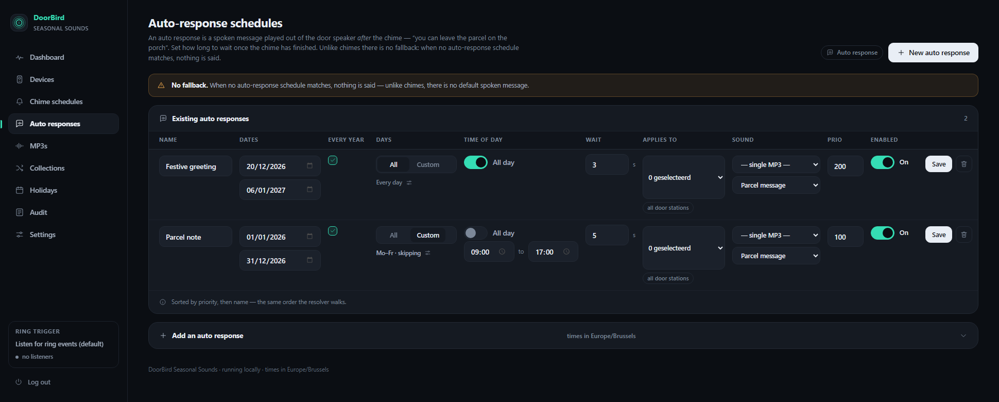
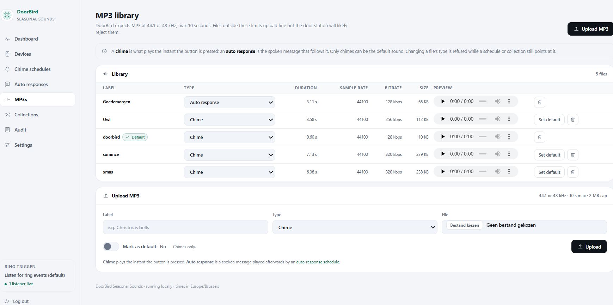
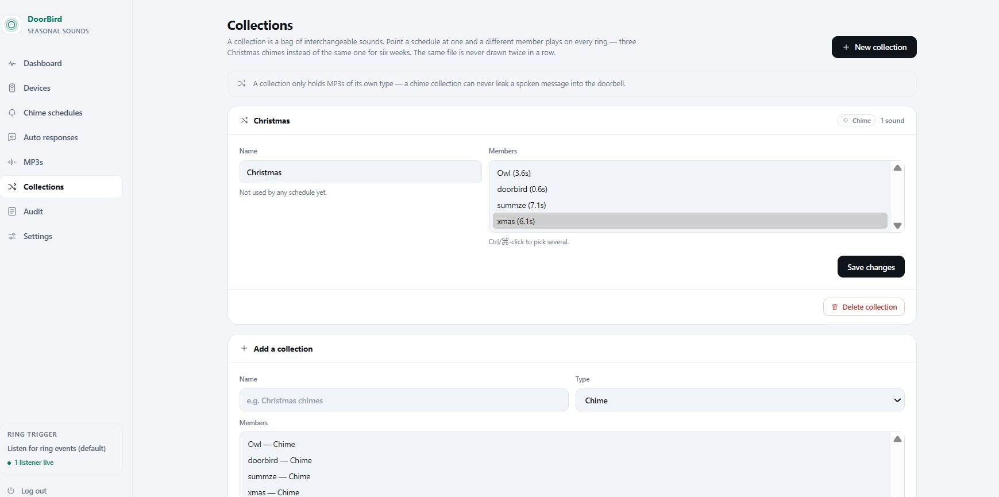
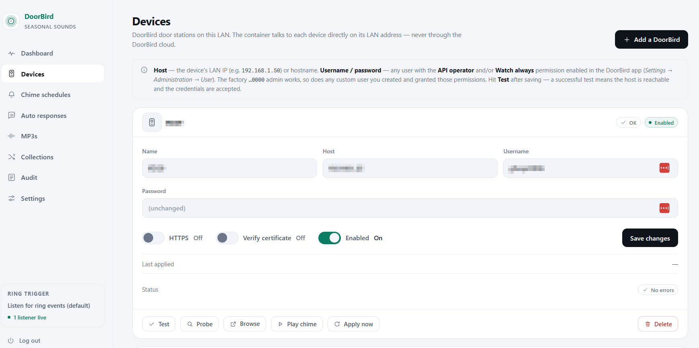
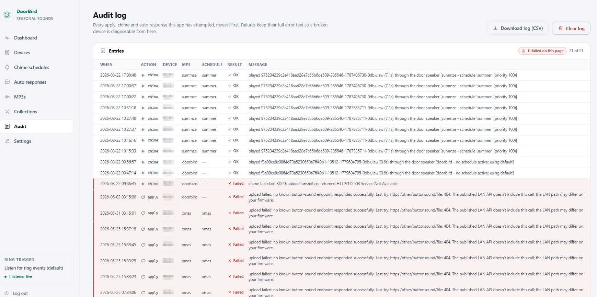
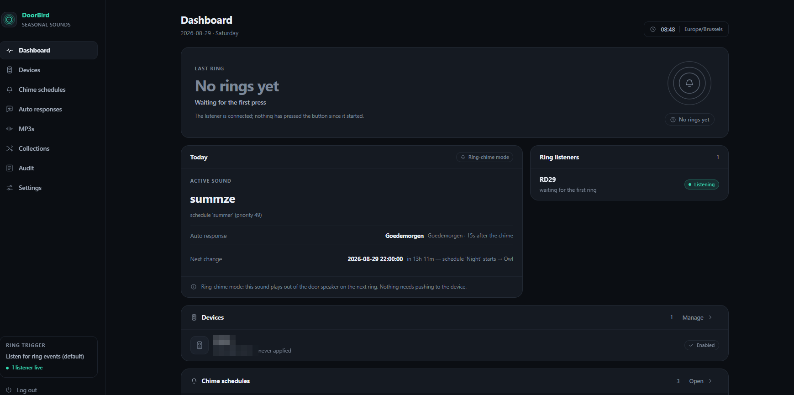

# DoorBird Seasonal Sounds

[](https://github.com/jovd83/doorbird-seasonal-sounds/actions/workflows/ci.yml)
[](CHANGELOG.md)
[](LICENSE)
[](pyproject.toml)
[](https://buymeacoffee.com/jovd83)

Make your DoorBird play a **different sound at the door depending on the
date** — Christmas, New Year, Easter, summer, whatever you configure — with a
default MP3 outside those windows.

It works by listening for the ring and streaming the seasonal audio out of the
door station's own speaker, rather than replacing the sound stored on the
device — see
[How the sound reaches the door station](#how-the-sound-reaches-the-door-station).

- 📖 **[User manual](docs/USER-MANUAL.md)** — day-to-day use, schedules, auto
  responses, collections, troubleshooting
- 🚀 [Install](#install) · [Configuration](#configuration) · [Development](#development)



<sub>The dashboard: what is playing right now, why, and when it next changes.
Device names and addresses are blurred in these screenshots.</sub>



## Features

- **Date-based chime schedules** — `MM-DD` ranges, recurring yearly or pinned
  to a specific year, with year-end wrap-around (`12-20 → 01-06`).
- **Auto responses** — a spoken message played after the chime once a
  configurable wait interval has passed ("you can leave the parcel on the
  porch"). Scheduled exactly like chimes, resolved independently of them.
- **Collections** — point a schedule at a bag of sounds and a different member
  plays on every ring, never the same one twice running.
- **Time-of-day windows** — optional `HH:MM` from/to per schedule, "all day" by
  default. Windows may wrap midnight (`22:00 → 02:00`).
- **Days of the week** — per-schedule weekday toggles with Mo–Fr / Sa–Su
  presets, editable straight from the schedule row.
- **Belgian holidays** — pick from the ten federal public holidays, three
  community days and six observances. A ticked holiday fires whatever weekday
  it lands on, and one switch expresses "Mo–Fr, but not on a public holiday".
  The five dates that move with Easter are computed once and stored a century
  ahead, so a ring never runs a date algorithm.
- **Days of the week** — per-schedule weekday toggles with Mo–Fr / Sa–Su
  presets, editable straight from the schedule row.
- **Belgian holidays** — pick from the ten federal public holidays, three
  community days and six observances. A ticked holiday fires whatever weekday
  it lands on, and one switch expresses "Mo–Fr, but not on a public holiday".
  The five dates that move with Easter are computed once and stored a century
  ahead, so a ring never runs a date algorithm.
- **Per-device targeting** — a schedule can apply to selected door stations, or
  to all of them.
- **Priority and specificity** — highest priority wins; ties go to the more
  specific window.
- **Ring-chime playback** — one listener per device, automatic reconnection
  with backoff, and a debounce so a held button chimes once.
- **Two trigger modes** — passive listening, or an authenticated webhook another
  system can call. Neither writes anything to the door station.
- **Optional off-season silence** — a toggle decides whether the default MP3
  plays on days no schedule matches, or whether the app stays quiet and leaves
  the door station's own chime to it.
- **Audit log** of every chime and auto response, with the reason a given sound
  was chosen; downloadable as CSV, clearable from the page, and pruned to
  `AUDIT_RETENTION_DAYS` by the daily job.
- **Hardened by default** — scrypt-hashed login with lockout, CSRF on every
  form, bounded uploads, and per-device TLS verification.
- **Dark-first responsive UI** — a sidebar on a desktop, a bottom bar on a
  phone, with a dark/light switch stored per install. The colour scheme is
  applied server-side, so pages never flash the wrong theme. Every page carries
  a live status strip showing the ring trigger and listener health.
- **Built-in diagnostics** — `tools/cli_diagnose.py` reports on credentials, ring events,
  speaker playback and endpoint reachability in one pass.

## The interface

<table>
<tr>
<td width="50%"><a href="screenshots/chime-schedules.png"></a></td>
<td width="50%"><a href="screenshots/auto-responses.png"></a></td>
</tr>
<tr>
<td><b>Chime schedules.</b> Every row edits in place. Highest priority wins;
ties go to the narrower window.</td>
<td><b>Auto responses.</b> Same shape, plus a wait interval — and no fallback,
so silence is the default.</td>
</tr>
<tr>
<td><a href="screenshots/mp3-library.png"></a></td>
<td><a href="screenshots/collections.png"></a></td>
</tr>
<tr>
<td><b>MP3 library.</b> Chimes and spoken messages are separate types, with
in-browser preview and the sample rate the door station expects.</td>
<td><b>Collections.</b> A bag of interchangeable sounds; a schedule pointed at
one draws a different member on every ring.</td>
</tr>
<tr>
<td><a href="screenshots/devices.png"></a></td>
<td><a href="screenshots/audit-log.png"></a></td>
</tr>
<tr>
<td><b>Devices.</b> Test, probe and play a chime on demand. Certificate
verification is per device, off by default for a stock self-signed unit.</td>
<td><b>Audit log.</b> Every chime and auto response with the reason that sound
was chosen. Failures keep their full error text.</td>
</tr>
</table>

The UI is dark-first, and the theme is stored per install rather than per
browser so a hallway tablet and a phone agree:



## Requirements

- A DoorBird device on the same LAN, firmware **000110 or newer**
- A DoorBird user with the **API operator** permission; **Watch always** as well
  is recommended (see the [user manual](docs/USER-MANUAL.md#device-permissions))
- Docker, **or** Python 3.12+ and `ffmpeg`

## Install

### Option A — Docker Compose (recommended)

```bash
git clone https://github.com/<you>/doorbird-seasonal.git
cd doorbird-seasonal
cp .env.example .env
```

Generate the two secrets and paste them into `.env`:

```bash
python3 - <<'PY'
import secrets
from cryptography.fernet import Fernet
print("SECRET_KEY=" + secrets.token_urlsafe(48))
print("FERNET_KEY=" + Fernet.generate_key().decode())
PY
```

Set a login. Either hash the password (preferred — no plaintext in the
environment or in `docker inspect`):

```bash
python -m app.hash_password        # prompts twice, prints ADMIN_PASSWORD_HASH=...
```

or just set `ADMIN_PASSWORD` and accept a warning at startup. Then:

```bash
docker compose build
docker compose up -d
docker compose logs -f
```

Open `http://<host>:8088/` and log in. `ffmpeg` is already in the image.

### Option B — Local Python

```bash
git clone https://github.com/<you>/doorbird-seasonal.git
cd doorbird-seasonal

python -m venv .venv
. .venv/bin/activate          # Windows: .venv\Scripts\Activate.ps1
pip install -e ".[dev]"
```

`ffmpeg` must be on your `PATH` — `apt install ffmpeg`,
`brew install ffmpeg`, or `winget install Gyan.FFmpeg`.

Copy `.env.example` to `.env`, fill in the same four values as above, then:

```bash
# bash
DATA_DIR=./data uvicorn app.main:app --reload

# PowerShell
$env:DATA_DIR = "./data"; uvicorn app.main:app --reload
```

Open `http://127.0.0.1:8000/`.

### Option C — Synology / other NAS

Copy the project to a folder on the NAS, then create a Container Manager
*Project* pointing at it and choose **Build**. Full notes, including the
bind-mount permission trap that bites most NAS deployments, are in
[deploy/synology/README.md](deploy/synology/README.md).

### Upgrading

```bash
git pull
docker compose up -d --build
```

Schema migrations run automatically at startup. Your `data/` directory is
never touched by an upgrade.

## Configuration

All settings come from `.env` (see [.env.example](.env.example)). Only the
first four are required.

| Variable | Default | Purpose |
|---|---|---|
| `ADMIN_USERNAME` | `admin` | Web UI login |
| `ADMIN_PASSWORD_HASH` | — | **Preferred.** scrypt hash from `python -m app.hash_password` |
| `ADMIN_PASSWORD` | — | Plaintext alternative. Hashed in memory at startup, but warns |
| `SECRET_KEY` | — | Signs session cookies |
| `FERNET_KEY` | — | **Encrypts stored device passwords — back this up** |
| `DATA_DIR` | `/data` | Database, MP3s, transcode cache, logs |
| `TZ` | `Europe/Brussels` | Timezone for schedules, logs and audit entries |
| `DAILY_RUN_HOUR` / `DAILY_RUN_MINUTE` | `3` / `15` | Daily job that pre-warms the transcode cache |
| `RING_CHIME_ENABLED` | `1` | Master switch for ring-triggered playback |
| `RING_DEBOUNCE_SECONDS` | `8` | Ignore repeat rings inside this window |
| `CHIME_MAX_SECONDS` | `15` | Longer MP3s are truncated |
| `CHIME_GAIN_DB` | `0` | Gain trim before μ-law encoding |
| `BUTTON_SOUND_UPLOAD_ENABLED` | `0` | Attempt the (blocked) stored-sound upload |
| `ENABLE_API_DOCS` | `0` | Serve `/docs`, `/redoc`, `/openapi.json` — unauthenticated, so off by default |
| `SESSION_HTTPS_ONLY` | `0` | Mark the session cookie `Secure`. Turn on behind a TLS proxy |
| `SESSION_MAX_AGE_SECONDS` | `604800` | How long a sign-in lasts |
| `AUDIT_RETENTION_DAYS` | `365` | Daily job prunes older audit rows. `0` keeps everything |
| `MAX_UPLOAD_BYTES` | `2097152` | Largest MP3 the upload forms accept |

> **Keep `FERNET_KEY` safe.** Device passwords are encrypted with it. Move
> `data/` to another host without the same key and the app will start but fail
> every connection with a decrypt error.

Trigger mode, the external base URL, the webhook token, off-season silence and
the dark/light theme are set in the UI under **Settings**, not in `.env`, so
they can change without a restart.

The web UI ships no framework and no webfont request — one stylesheet,
`app/static/style.css`, and a system font stack. That is deliberate: the
container usually sits on a LAN with no route to the internet, and a blocking
CDN request would leave the interface unstyled there. The theme is stored per
install rather than per browser, so a hallway tablet and a phone agree.

## How the sound reaches the door station

Two endpoints, both in the published LAN API:

| Step | Method | Endpoint | Purpose |
|---|---|---|---|
| 1 | `GET` | `/bha-api/monitor.cgi?ring=doorbell` | Held open; streams `doorbell:H` the instant the button is pressed |
| 2 | `POST` | `/bha-api/audio-transmit.cgi` | Streams today's MP3, transcoded to μ-law, out of the door speaker |

Details that matter:

- **The format is fixed.** `audio-transmit.cgi` accepts G.711 μ-law, 8 kHz,
  mono — telephone band. Each MP3 is converted once and cached in `data/ulaw/`.
- **The body must be paced.** μ-law at 8 kHz is exactly 8000 bytes per second,
  and the device expects roughly real time — DoorBird's own documented `curl`
  example pins this with `--limit-rate 8K`. The client uses a raw socket to
  send an HTTP/1.0 request with a real `Content-Length`, writing 100 ms at a
  time.
- **Permission.** The endpoint needs *Watch always*, **or** a ring in the last
  5 minutes — and a ring satisfies that by definition.
- **One consumer at a time.** If someone has live view or talk open the device
  answers `503`; the client retries briefly, then gives up rather than talking
  over a real conversation.
- **The trigger is passive.** `monitor.cgi` changes nothing on the device.

## Limitations

- **Telephone-band audio.** 8 kHz μ-law is what the endpoint accepts. Bells and
  short jingles carry well; wide-band music does not.
- **The built-in chime still fires** unless you silence it once by hand in the
  DoorBird app under *Administration → Button sound*.
- **Slight delay** — the chime follows the press by roughly a second.
- **Not while someone is talking** — a live-view or talk session owns the audio
  channel, and the chime backs off.
- Replacing an **indoor station** chime is out of scope, as is TTS.

## Development

```bash
pip install -e ".[dev]"
pytest -q          # 355 tests
ruff check .
```

The suite is hermetic — `tests/conftest.py` pins `DATA_DIR` to a temp
directory before any app import, so running tests never touches a real
database. It covers the resolution rules, the schedule forms, the collection
draw, a full ring through to the audit trail with the door station stubbed
out, and an end-to-end pass over every page.

It also covers the things that are easy to get wrong and quiet when you do:
the login redirect and CSRF guards, password hashing, upload size limits, the
watcher restarting when a device is edited, WAL and concurrent writes, and all
three database states a migration can start from — brand new, pre-Alembic with
live rows, and already managed.

### Migrations

Schema changes are Alembic revisions under `app/migrations/versions/`.

```bash
alembic revision --autogenerate -m "what changed"
alembic upgrade head          # or just start the app, which does it
```

A database created before Alembic was adopted is detected at startup, brought
to the baseline shape once by the legacy bridge, stamped, and then upgraded
normally. It is never re-created and its rows are never rewritten.

```
app/
  main.py            FastAPI app + lifespan (DB, scheduler, ring watchers)
  config.py          env-driven settings          models.py    ORM models
  db.py              engine, session, migrations  crypto.py    Fernet wrapper
  date_logic.py      which schedule applies now   engine.py    resolution, draw + audit
  doorbird/          everything that talks to a door station
                     types · client (HTTP) · audio_transmit (socket) · diagnostics
  audio.py           MP3 -> μ-law transcode + cache
  mp3_library.py     bounded, streamed upload storage (shared by two routes)
  passwords.py       scrypt hashing for the admin login
  security.py        auth, CSRF, redirect safety
  shell.py           per-request shell state (keeps the DB out of templates)
  schedule_form.py   form parsing and validation, with no HTTP in it
  schema.py          migration strategy (new / pre-Alembic / managed)
  ring/              debounce · playback · watcher (one listener per device)
  migrations/        Alembic environment and revisions
  settings_store.py  runtime settings (trigger mode, token, base URL, theme)
  templating.py      Jinja filters, inline icon set, one shared nav list

  routes/            web UI + ring webhook        templates/   Jinja2
                     dashboard · devices · schedules (both kinds)
                     mp3s · collections · audit · settings · ring hook
tools/               dev-only probe scripts (not shipped in the image)
deploy/synology/     NAS deployment notes
docs/USER-MANUAL.md  end-user documentation
home_assistant/      optional HA custom component
```

## Security notes

- Put the app behind your LAN only, or a reverse proxy / VPN. It has no TLS of
  its own and a single admin account.
- The admin password is stored as an scrypt hash and verified in constant time.
  Repeated failures from one address lock that address out for five minutes.
- Every mutating form carries a CSRF token, enforced by a router dependency.
  `SameSite=lax` is a second line of defence, not the only one.
- `?next=` on the login form is restricted to same-site paths, so the page
  cannot be used to bounce someone to another origin.
- Uploads are streamed to disk with a hard size cap rather than buffered whole.
- Device passwords are encrypted at rest with `FERNET_KEY`. A key that no
  longer fits isolates that one device instead of stopping the app.
- Certificate verification for a door station is per device and off by default,
  because a stock unit ships a self-signed certificate and is reached by IP.
  Turn it on if you have installed a real one.
- The ring webhook is deliberately **not** session-protected — a door station
  or controller cannot log in. Its URL token is the credential; rotate it from
  the Settings page if it leaks.
- `.env`, the database, your MP3s and the transcode cache are all
  git-ignored. Nothing personal is committed.

## License

[MIT](LICENSE). No warranty. DoorBird is a trademark of Bird Home Automation
GmbH; this project is not affiliated with, endorsed by, or supported by them.
