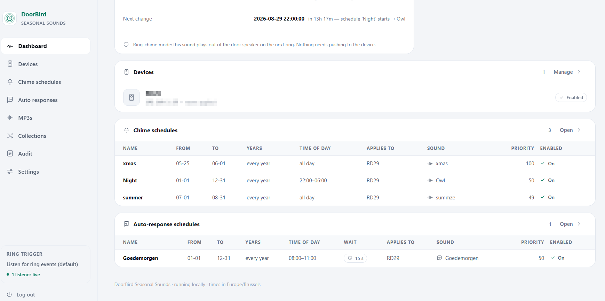

# User manual

Day-to-day use of DoorBird Seasonal Sounds. For installation see the
[README](../README.md#install).

- [First run](#first-run)
- [Finding your way around](#finding-your-way-around)
- [Dashboard](#dashboard)
- [Devices](#devices)
- [MP3 library](#mp3-library)
- [Collections](#collections)
- [Holidays](#holidays)
- [Chime schedules](#chime-schedules)
- [Auto responses](#auto-responses)
- [What plays right now](#what-plays-right-now)
- [Settings](#settings)
- [Changing the login](#changing-the-login)
- [Appearance](#appearance)
- [Testing and diagnostics](#testing-and-diagnostics)
- [Audit log](#audit-log)
- [Troubleshooting](#troubleshooting)

---

## First run

Open the app and log in with the credentials from your `.env` — either
`ADMIN_USERNAME` with `ADMIN_PASSWORD_HASH` (preferred) or with a plaintext
`ADMIN_PASSWORD`. To change them later, edit `.env` and restart; there is no
account page, and there is only one account. See
[Changing the login](#changing-the-login). Then, in order:

1. **Upload at least one MP3** and mark it **default**.
2. **Add your door station** and hit *Test*.
3. Optionally add **chime schedules** for the seasons you care about, and
   **auto responses** for messages that follow the chime.

Until a default MP3 exists, nothing can play — the dashboard warns about this.

### Recommended one-time step

The door station plays its **own** built-in chime on a ring, so out of the box
you hear both that and the seasonal sound. Silence the built-in one by hand,
once, in the DoorBird app under *Administration → Button sound*. It never has
to change again — this app supplies the variety.

---

## Finding your way around

The app is a **sidebar** on a desktop screen and a **bottom bar** on a phone;
both render from the same list, so nothing can be missing from one of them.

| Section | What lives there |
|---|---|
| **Dashboard** | What plays next, last ring, listener health, both schedule tables |
| **Devices** | Your door stations, their credentials and test buttons |
| **Chime schedules** | What the doorbell sounds like, and when |
| **Auto responses** | Spoken messages that follow the chime |
| **MP3s** | The sound library, and each file's type |
| **Collections** | Bags of interchangeable sounds |
| **Holidays** | The Belgian holidays a schedule can pick from, and their dates |
| **Audit** | Every attempt this app has made |
| **Settings** | Trigger mode, webhook, off-season behaviour, appearance |

On a phone the bar keeps **Dashboard, Devices, Chimes, Auto**; the rest sit
behind **More**. That sheet works without JavaScript.

### The status strip

The bottom of the sidebar always shows the **ring trigger** in use and how the
listeners are doing, on every page — so a stopped listener is visible while you
are somewhere else entirely:

| Reads | Means |
|---|---|
| *N listeners live* | Connected and waiting for a press. Normal. |
| *N reconnecting* | The device is unreachable or rebooting. Retries on its own with backoff — routine, not an error. |
| *N of M listeners stopped* | A listener thread has died. **Rings on that station will not chime.** |
| *webhook only* | Trigger mode is *External trigger*; nothing is being listened to on purpose. |
| *no listeners* | No enabled device, or ring chime is switched off. |
| *ring chime off* | `RING_CHIME_ENABLED=0` in the environment. |

---

## Dashboard


<sub>Device names and LAN addresses are blurred throughout these screenshots.</sub>

The one page to check when something seems wrong.

### Last ring

The big figure at the top is the **time of the most recent ring** across all
devices, with how long ago that was and which station it came from. If nothing
has rung for days it turns amber and says **Stale** — which usually means a
listener quietly stopped, not that nobody visited.

If a listener has actually stopped, a red banner names the device and says the
chime will not play until it is restarted.

### Today

- **Active sound** — what a ring would play right now, and why (the winning
  schedule, its priority and time window). Says *"none — staying silent"* when
  off-season silence is switched on.
- **Auto response** — the spoken message due after the chime, and its wait
  (counted from the end of the chime, not from the button press), or
  *none scheduled right now*.
- **Next change** — the exact **date and time** the chime next changes, how far
  off that is, and what it changes to. Because schedules can have time-of-day
  windows, this is given to the minute rather than to the day; a collection is
  named as a collection, since which member plays is decided at the ring.

Below that are the two schedule tables — **chime** and **auto-response** — as a
read-only overview. Edit them on their own pages.



---

## Devices


*Devices* → fill in a name, the LAN IP, and a DoorBird username/password.
Passwords are encrypted before they are stored.

Three switches per device:

| Switch | Meaning |
|---|---|
| **HTTPS** | Talk to the device over TLS instead of plain HTTP |
| **Verify certificate** | Check that certificate. **Off by default** — a stock door station ships a self-signed certificate and is reached by IP, so verification cannot succeed. Turn it on only if you have installed a real one |
| **Enabled** | Whether this station is watched and played to at all |

Editing any of these takes effect immediately — the listener for that device is
restarted with the new settings rather than waiting for a container restart.

### Device permissions

In the DoorBird app, under *Settings → Administration → User*, the account you
use needs:

| Permission | Needed for |
|---|---|
| **API operator** | Reading device info and configuration |
| **Watch always** | Playing audio at any time |

Without *Watch always*, playback only works within **5 minutes of a ring** —
which is fine for chiming, since a ring is what triggers it. If you also want
the *Play chime* test button to work at any moment, enable it.

You do **not** need the factory administration account (`…0000`). Any user with
these permissions works.

### Buttons

| Button | What it does |
|---|---|
| **Test** | Checks credentials and reachability via `info.cgi` |
| **Play chime** | Plays today's sound at the door **right now** — audible, so it asks first |
| **Probe** | Scans candidate endpoints; diagnostic only |
| **Browse →** | Opens the device's own web page, handy for verifying credentials |
| **Apply now** | Pushes today's sound to the device's stored button sound. Only useful with `BUTTON_SOUND_UPLOAD_ENABLED=1`, which most firmware refuses |

---

## MP3 library


*MP3s* → upload files and mark exactly one as **default**. The default plays
whenever no chime schedule matches.

### MP3 types

Every file is either a **chime** or an **auto response**:

| Type | What it is | Where it can be used |
|------|------------|----------------------|
| **Chime** | What a visitor hears the instant they press the button | Chime schedules; can be the default |
| **Auto response** | A spoken message played after the chime | Auto-response schedules only |

Set the type when uploading, or change it later from the **Type** column. The
change is refused while a schedule or a collection still uses the file — point
those at something else first. Only a chime can be the default.

**Pick clips that survive the trip.** Audio is downsampled to 8 kHz mono μ-law
— telephone quality — because that is all the door station's audio endpoint
accepts. Bright, percussive sounds (bells, chimes, short jingles) come through
well. Bass-heavy or richly produced music does not.

Keep clips **short**, a few seconds at most; anything beyond
`CHIME_MAX_SECONDS` (default 15) is truncated. If the result is too quiet at
the door, raise `CHIME_GAIN_DB` in `.env` a few dB — the cache re-transcodes
automatically when that changes.

A file outside DoorBird's limits is flagged **Out of spec** in the library. It
still uploads and still plays through the ring-chime path — the marker is there
because the door station is what may reject it.

---

## Collections


*Collections* → a named bag of interchangeable sounds. Point a chime schedule
at one and a **different member plays on every ring**, so three Christmas
chimes rotate instead of the same one for six weeks.

- The same file is **never drawn twice in a row**. With three members you hear
  all three; with one, that one every time.
- A collection only holds MP3s of **its own type**, so a spoken message can
  never leak into the doorbell.
- The draw happens at the moment of the ring. The dashboard therefore shows
  the collection name rather than guessing which member is next.
- A collection in use by a schedule cannot be deleted or emptied. Repoint the
  schedule first.

Auto responses can use collections too — useful for varying the wording of a
delivery message.

---

## Holidays

A read-only reference: the nineteen Belgian holidays a schedule can pick from,
grouped, each with the rule it follows, the date it **next** falls on, and which
schedules currently use it.

There is nothing to edit here. The catalogue is fixed, and the page exists to
answer the one question the picker cannot: *when is that, exactly?*

### Why five of them are stored

Fourteen entries are a fixed date — 25 December is 25 December, and that is the
whole rule. The other five move with Easter:

| Holiday | Rule |
|---|---|
| Easter Sunday | Easter |
| Easter Monday | Easter + 1 day |
| Ascension Day | Easter + 39 days |
| Whit Sunday | Easter + 49 days |
| Whit Monday | Easter + 50 days |

Their dates are worked out once, on first start, and written to the database —
one row per holiday per year for **a hundred years ahead**, 500 rows in all. So
answering "is today a holiday?" when the doorbell rings is a lookup rather than
a calculation on the thread that should be pushing audio at the door station.

The horizon rolls forward on its own. Every start tops the table up, so a full
century is always ahead of you; nothing is ever deleted, so past years stay
readable too.

---

## Chime schedules


*Chime schedules* → each entry says **what** plays, **when**, and **where**.

Existing schedules edit in place: change a field and press **Save** on that
row. The **Add a chime schedule** panel at the bottom is collapsed by default —
click its header, or the **New chime schedule** button at the top, to open it.

The auto-response page works identically; only the wait interval and the
absence of a fallback differ.

### Name and dates

- **Start** / **End** — the calendar window. Leave End blank for a single day.
- **Recurring annually** — ignores the year, matching only month/day. This is
  what you want for Christmas or a birthday.
- Ranges may **wrap year-end**: `12-20 → 01-06` covers Christmas and New Year.
- **Priority** — higher wins when several schedules match.
- **Enabled** — untick to park a schedule without deleting it.

### Time of day

"All day" is on by default. Switch it off to reveal a **from / to** pair in
24-hour time:

- `08:00 → 22:00` — daytime only; outside it, the next-best schedule (or the
  default) applies.
- `22:00 → 02:00` — a start later than the end **wraps past midnight**.

Both ends are inclusive.

### Days and holidays

By default a schedule runs on **every day** inside its date range. This panel
narrows that down.

**Days of the week.** Seven toggles, plus four presets that just tick boxes for
you — *Every day*, *Weekdays · Mo–Fr*, *Weekend · Sa–Su*, *None*. There is no
mode to be "in": change any single day afterwards and the schedule keeps
working, the preset simply stops being highlighted.

**Belgian holidays.** Nineteen entries in three groups — the ten federal public
holidays, three community days, and six observances (Sinterklaas, Halloween,
Valentine's Day and so on). Tick the ones this schedule should fire on. The
full list, with the date each one next falls on, is on the
[Holidays](#holidays) page.

**The rule is a union.** A day matches when it is a ticked weekday **or** a
ticked holiday:

| Days | Holidays | Fires on |
|---|---|---|
| Mo–Fr | — | Monday to Friday, whatever the date |
| Mo–Fr | Christmas Day | Monday to Friday, **and** Christmas — even when it falls on a Sunday |
| none | Christmas Day, Sinterklaas | only those two days, whatever weekday they land on |

That is the whole point of the union: "Mo–Fr plus Christmas" is what people
actually want, and an intersection could not express it without ticking all
seven days.

**Skip public holidays.** The one subtraction, and the way to say *"Mo–Fr, but
not on a public holiday"*. With it on, a day that matched **only because of its
weekday** is dropped when it is one of the ten federal public holidays.

Two things it deliberately does not do:

- It never drops a holiday you ticked yourself. Naming Christmas Day and
  skipping it in the same breath is not a rule, it is a contradiction, so the
  explicit tick wins.
- It only looks at the ten **public** holidays. Community days and observances
  never subtract anything — they only ever add a day when ticked.

With no weekday ticked at all there is nothing for it to subtract from, so the
switch is disabled rather than quietly ignored.

**A schedule needs at least one day or one holiday.** Ticking neither would
create something that can never play, which is almost always a half-finished
edit — use the **Enabled** switch to silence a schedule instead.

### Apply to

Select the door stations this schedule covers. **Select none to apply to all of
them** — which is what every schedule does until you say otherwise.

The box is one line high to keep the table compact; scroll inside it, and
Ctrl/⌘-click to pick several.

This lets a front door and a garden gate run different sounds from one install.

### Sound

Either a **collection** (a member is drawn per ring — see
[Collections](#collections)) or a **single MP3**. Picking a collection
overrides the single-MP3 choice. You can also upload a new file straight from
the form; it is filed as a chime and used immediately.

---

## Auto responses


*Auto responses* → a spoken message played out of the door speaker **after**
the chime: *"you can leave the parcel on the porch"*.

They are scheduled exactly like chime schedules — same dates, same time-of-day
windows, same per-device targeting, same priority rules — with one extra field:

### Wait interval

**Seconds to wait once the chime has finished**, not since the button press.
`0` speaks the message immediately after the chime. The maximum is 3600
seconds; anything longer is almost certainly a typo.

The clock starts when the chime's last sample has left for the device, so the
message reaches the door speaker noticeably later than the interval alone
suggests:

    button press
      + chime length
      + wait interval
      + transcoding, the first time an MP3 is played after being uploaded
      = when the message is heard

A 7-second chime with a 15-second wait speaks at roughly **T+22s**, not T+15s.

> **Keep that total under about 30 seconds.** A DoorBird only plays transmitted
> audio while the ring session it opened is still live — roughly as long as it
> rings your phone. Past that the device still accepts the upload and still
> answers `200`, so the audit log records it as played, but nothing comes out of
> the speaker. If a message is logged `OK` and nobody heard it, this is the first
> thing to check: shorten the wait, or pick a shorter chime.

### How it differs from a chime

- **No fallback.** A chime falls back to the default MP3 when nothing matches.
  An auto response simply does not play.
- **Independent of the chime.** If the chime is silent — because no schedule
  matched and *"play the default"* is off — a due auto response still speaks.
- **Never blocks the ring.** The message plays on its own thread, so the
  webhook and the *Test chime* button return immediately.
- Chime and auto-response schedules are resolved **separately**, so one of each
  can be active at the same moment.

---

## What plays right now

For each device, at the moment of a ring, the chime and the auto response are
resolved **separately** with the same rules:

1. Collect every **enabled** schedule *of that kind* whose **date window**,
   **time window** and **device list** all match.
2. If none match → for a chime, the **default MP3**, unless *"play the default
   when no schedule is active"* is switched off in Settings, in which case
   nothing is sent at all. For an auto response, nothing is played.
3. If several match → the **highest priority** wins.
4. On a tie → the **most specific** wins: narrower time window first, then
   narrower date range, then lowest id.

5. If the winning schedule uses a **collection**, one member is drawn at that
   moment, skipping whatever played last.

The dashboard shows today's resolution and the reason, e.g.
`schedule 'Christmas' (priority 200) 17:00–23:00`, the auto response due next,
and **Next change** — the exact date *and time* the chime next changes, with
how far off that is.

> Because a time window makes a schedule more specific, a two-hour evening rule
> at priority 100 beats an all-day rule at priority 100. Use priority when you
> want an explicit override.

---

## Settings

### Play the default when no schedule is active

**On by default.** Every ring then plays something: a matching schedule's
sound, or the default MP3 on days nothing matches.

Switch it **off** and off-season rings produce no audio from this app at all —
visitors hear only the door station's own built-in chime. Schedules still play
normally while they are active, so you get the seasonal sound at Christmas and
nothing the rest of the year.

The dashboard says *"none — staying silent"* when this is in effect, and the
audit log records the ring rather than treating it as a failure.

### Trigger mode

How the app finds out the bell was pressed. **Neither mode writes anything to
the door station.**

| Mode | How | When to choose it |
|---|---|---|
| **Listen for ring events** *(default)* | The app holds `monitor.cgi` open | Simplest; nothing to configure on the device |
| **External trigger** | Another system calls this app's `/ring/<token>` URL | You already have something that knows about rings, or you would rather not hold a connection open |
| **Both** | Whichever arrives first wins | Belt and braces; a shared debounce prevents a double chime |

### ⛔ Be aware when registering the webhook on the DoorBird itself

The LAN API permits **one HTTP entry per event slot**. If something already
owns the doorbell's HTTP call, adding this app's URL **replaces it**, which
silently breaks that integration. Check what is there before changing
anything:

```bash
curl -s -u <user>:<pass> "http://<doorbird-ip>/bha-api/favorites.cgi"
curl -s -u <user>:<pass> "http://<doorbird-ip>/bha-api/schedule.cgi"
```

Instead, have whatever **already receives** the ring call this app.

### Address other systems use

Set this to the address a caller on your LAN would dial, e.g.
`http://192.168.1.50:8088`. It cannot be detected reliably: in a container the
port the app listens on internally is usually **not** the published port, so
the app would otherwise guess from your browser's address bar. The page warns
you if the value only resolves locally.

### Webhook

One plain `GET`, no body, no headers:

```bash
curl "http://<this-host>:<port>/ring/<token>?device=<id>"
```

`{"ok": true}` means the ring was accepted. It replies **immediately** and
plays afterwards, so the caller never waits for the audio. A duplicate inside
the debounce window returns `{"ok": false}` — normal, not an error.

The token in the URL is the only credential, since a caller cannot log in.
**Rotate token** invalidates every URL already configured elsewhere.

### Forward ring to

Optional. Relays each ring to another URL *before* chiming, so one press can
fan out to a second system. Credentials embedded in that URL are redacted in
the logs.

---

## Changing the login

There is no account page — the login comes from the environment, and there is
only **one** account. To change it, edit `.env` and restart the container.

The username is plain:

```
ADMIN_USERNAME=your-name
```

For the password, prefer a hash so no plaintext sits in the environment or in
`docker inspect` output:

```bash
python -m app.hash_password
```

It prompts twice, echoes nothing, and prints a line to paste into `.env`:

```
ADMIN_PASSWORD_HASH=scrypt$16384$8$1$<salt>$<key>
```

Add that and **delete the `ADMIN_PASSWORD` line**. A plaintext
`ADMIN_PASSWORD` still works — it is hashed in memory at startup, so it is
never compared as plaintext — but the app logs a warning every boot.

After eight failed sign-ins from one address, that address is locked out for
five minutes.

> **Never change `FERNET_KEY`.** It decrypts your stored device passwords.
> Change it and every door station's credentials become unreadable; you would
> have to re-enter them on the Devices page. `SECRET_KEY` is safe to rotate —
> it only signs session cookies, so rotating it just signs you out.

---

## Appearance

*Settings → Appearance* switches the interface between **dark** and **light**.

Dark is the default: this mostly gets opened on a hallway tablet or a phone,
and the interface is designed dark-first. Light mode keeps the same contrast.

The choice is stored **per install, not per browser**, so the wall tablet and
your phone agree. The scheme is applied server-side as the page renders, so
there is no flash of the wrong colour on load. Without JavaScript the switch
falls back to two plain buttons.

---

## Testing and diagnostics

**Play chime** on the *Devices* page plays today's sound at the door
immediately. It is genuinely audible outside, so it confirms first.

For a deeper check, run the built-in diagnostic:

```bash
# container
# From a checkout — the probe tools are not shipped in the image.
python -m tools.cli_diagnose <device-name>

# local
python -m tools.cli_diagnose <device-name>
```

It reports four things:

| Check | Meaning if it fails |
|---|---|
| 1. `info.cgi` | Credentials or reachability are wrong |
| 2. `monitor.cgi` | Ring events cannot be received — chiming will never trigger |
| 3. `audio-transmit.cgi` | Audio cannot be played; check *Watch always* |
| 4. `customsound.cgi` | Informational only; ring-chime mode does not need it |

**Check 3 posts one second of silence**, so it makes no noise at the door.
Checks 1–3 are the ones that matter.

---

## Audit log


*Audit* records every chime and auto-response attempt with a timestamp (in
your configured timezone), the device, the MP3, the schedule that won, and the
outcome.

This is the fastest way to confirm a real doorbell press worked: ring the bell,
reload the page, and look for a `chime` entry — followed by an `auto-response`
entry if one was due.

Entries older than `AUDIT_RETENTION_DAYS` (default 365) are removed by the
daily job, so the log cannot grow without limit. Set it to `0` to keep
everything.

### Download log

**Download log (CSV)** exports the **whole** log, oldest first — not just the
200 rows on screen. Columns: timestamp, action, device, MP3, schedule, success,
message.

### Clear log

**Clear log** deletes every entry. It cannot be undone, so download first if
you want to keep the history. The clear itself is recorded as an `audit-clear`
entry, so the page is never blank without explanation.

---

## Troubleshooting

| Symptom | Cause and fix |
|---|---|
| Status strip says **reconnecting** | The device is unreachable or rebooting. The watcher retries with backoff on its own; no action needed unless it persists. |
| Status strip says **stopped** | A listener thread died. The dashboard banner names the device. Check it is reachable and enabled. |
| Status strip says **no listeners** | No device is enabled, or ring chime is off (`RING_CHIME_ENABLED=0`). |
| Dashboard says **Stale** | No ring for days. Usually a listener that stopped reporting rather than a quiet doorbell — check the status strip. |
| Chime never plays on a ring | Run `cli_diagnose`; check 2 must pass. Also confirm the device is enabled. |
| `503` in the audit log | Someone had live view or talk open; the audio channel allows one consumer. Normal if it is occasional. |
| `204` on audio | The user lacks *Watch always* and there was no recent ring. |
| Sound is too quiet | Raise `CHIME_GAIN_DB`, and check the door station's own volume setting. |
| Sound is muddy | Inherent to 8 kHz telephone band. Choose a brighter, more percussive clip. |
| You hear **two** sounds | The built-in chime is still enabled — silence it in the DoorBird app. |
| Chime plays **twice** | Two instances are running against one device. Only one should be. |
| `attempt to write a readonly database` | The data directory is not writable by the container. See [deploy/synology/README.md](../deploy/synology/README.md). |
| Every connection fails after a move | `FERNET_KEY` does not match the one that encrypted the stored passwords. Restore the original key, or re-enter the device password. |
| Webhook returns `404` | Wrong token, or the trigger mode is not *External trigger* / *Both*. |
| A chime plays but no auto response | No auto-response schedule matches right now — they have no default fallback. Check the dashboard's *Auto response* line. |
| Auto response logged `OK` but never heard | It reached the device after the post-ring audio window closed. `audio-transmit.cgi` answers `200` when it accepts the upload, not when it plays it, so the entry reads `OK` either way. Add the chime length to the wait interval and keep the total under ~30s. |
| Cannot change an MP3's type | A schedule or a collection still points at it. Repoint that first. |
| Cannot delete a collection | A schedule still uses it. Point that schedule at a single MP3 first. |
